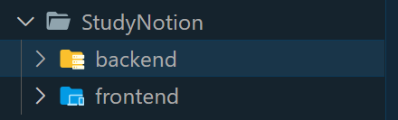

# Study-Notion-Mern

> StudyNotion is a Edtech website. Where a "Instructor" can upload his courses and a "Student" can watch his lectures by paying him. This website is built using MERN (MongoDB, Express, React, NodeJs) Technologies. Frontend/UI is base on React, Redux, Tailwind, CSS, Javascript and HTML.

## Links

> #### Full Stack GitHub Repo - [Click Here](https://github.com/sunny8080/Study-Notion-Mern)
>
> #### Frontend GitHub Repo - [Click Here](https://github.com/sunny8080/Study-Notion-Mern-Frontend)
>
> #### Backend GitHub Repo - [Click Here](https://github.com/sunny8080/Study-Notion-Mern-Backend)
>
> #### Frontend Live at - [https://study-notion-sunny8080.shop](https://study-notion-sunny8080.shop)
>
> #### Backend Live at - [https://api.study-notion-sunny8080.shop](https://api.study-notion-sunny8080.shop)

## Usage

This is a Edtech website, where user can be Instructor or an Student. Instructor can upload his courses and Student can enroll in his courses by paying him and watch his lectures.

## How to Use

> ##### Your directory will look like this -



> Run Frontend as well as Backend simultaneously

&nbsp;

### 1. Create a directory StudyNotion

```
mkdir StudyNotion
```

### 2. Move to StudyNotion directory

```
cd StudyNotion
```

### 3. SetUp Frontend

#### 3.1 Clone or extract frontend github repo in current directory ( StudyNotion directory )

```
git clone https://github.com/sunny8080/Study-Notion-Mern-Frontend frontend
```

#### 3.2 Move to frontend directory

```
cd frontend
```

#### 3.3 Install dependencies of frontend

```
npm i
```

#### 3.4 Rename "example.env" to ".env" and set/update all the values/settings of your own

```
mv example.env .env
```

### 4. Move back to StudyNotion directory

```
cd ..
```

### 5. SetUp Backend

#### 5.1 Clone or extract backend github repo in current directory ( StudyNotion directory )

```
git clone https://github.com/sunny8080/Study-Notion-Mern-Backend backend
```

#### 5.2 Move to backend directory

```
cd backend
```

#### 5.3 Install dependencies of backend

```
npm i
```

#### 5.4 Rename "config/example.config.env" to "config/config.env" and set/update all the values/settings of your own

```
mv config/example.config.env config/config.env
```

### 6. Move to Frontend directory

```
cd ../frontend
```

### 7. Run App

> #### Frontend will run on Port 3000 (By default)
>
> #### Backend will run on Port 4000 (By default)

```
npm run dev
```

## Live at

The Website is live at - [https://study-notion-sunny8080.shop](https://study-notion-sunny8080.shop)

>

The Website is live at ( on Netlify ) - [https://study-notion-mern-sunny8080.netlify.app/](https://study-notion-mern-sunny8080.netlify.app)

- Version - 1.0.0
- License: sunny8080
- Author: Sunny Kumar
